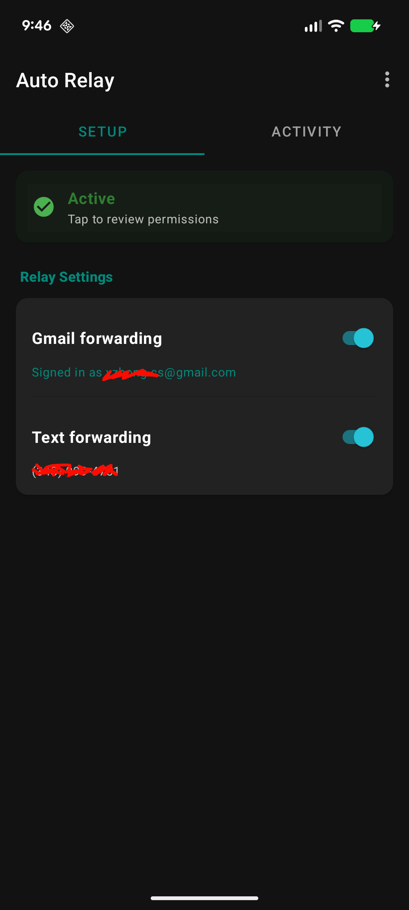
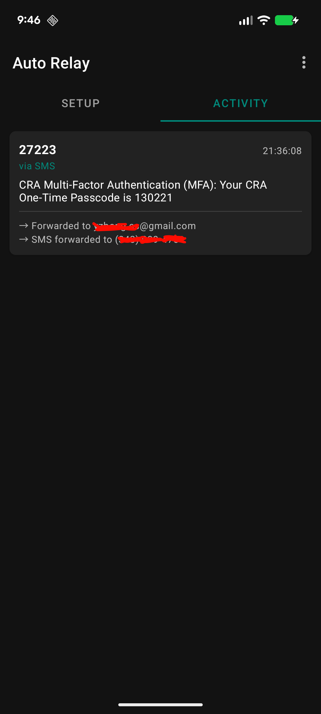

# Auto Relay

An Android app that listens to incoming messages and forwards them to another number or email.

## Screenshots

| Setup | Activity |
|-------|----------|
|  |  |

## Why

If you use a secondary Android device (or a SIM you don't carry), important messages — OTP codes, 2FA prompts, bank alerts — get stranded on that device. Auto Relay forwards them to wherever you actually are, in real time, so you never miss a verification code because it landed on the wrong phone.

Email forwarding also unlocks agentic workflows: an AI agent monitoring an inbox can read incoming OTPs and 2FA codes and act on them autonomously, without any manual intervention on the phone.

## Features

- Forwards incoming SMS messages to email (via Gmail API + OAuth) or another phone number
- Detects Google Messages notifications as a best-effort fallback for RCS messages
- Deduplicates messages that arrive via both SMS and RCS notification
- Logs all received messages and forwarding outcomes in-app

## Requirements

- Android 8.0+ (API 26+)
- Google Messages installed and set as the default SMS app for the RCS fallback
- A JDK (e.g. [Temurin](https://adoptium.net)) or Android Studio (JDK 17 or 21 recommended)

## Build & Run

Open & build the project in Android Studio, or use the command line:

```sh
# Build and install on a connected device
./gradlew installDebug

# Generate a release APK
./gradlew :app:assembleRelease

# Generate a release App Bundle (AAB) for Play Store
./gradlew :app:bundleRelease

# Stream logs
adb logcat -s AutoRelay
```

For Gmail email forwarding setup, see [Configuring Gmail Email Forwarding](docs/faq/configuring-gmail-email-forwarding.md).

## Get the App

To install the pre-built version, join the [auto-relay-testing](https://groups.google.com/g/auto-relay-testing) Google group to get access, then download it:

- **On Android:** [Google Play Store](https://play.google.com/store/apps/details?id=com.autorelay.app)
- **On the web:** [Play Store testing page](https://play.google.com/apps/testing/com.autorelay.app)

To report an issue, visit the [GitHub issue tracker](https://github.com/yzhong52/auto-relay/issues).

## Permissions

- `RECEIVE_SMS` — listen for incoming SMS
- `READ_SMS` — read SMS message content
- `SEND_SMS` — forward messages via SMS
- `INTERNET` — send emails via Gmail API
- Notification access — inspect Google Messages notifications for the RCS fallback

