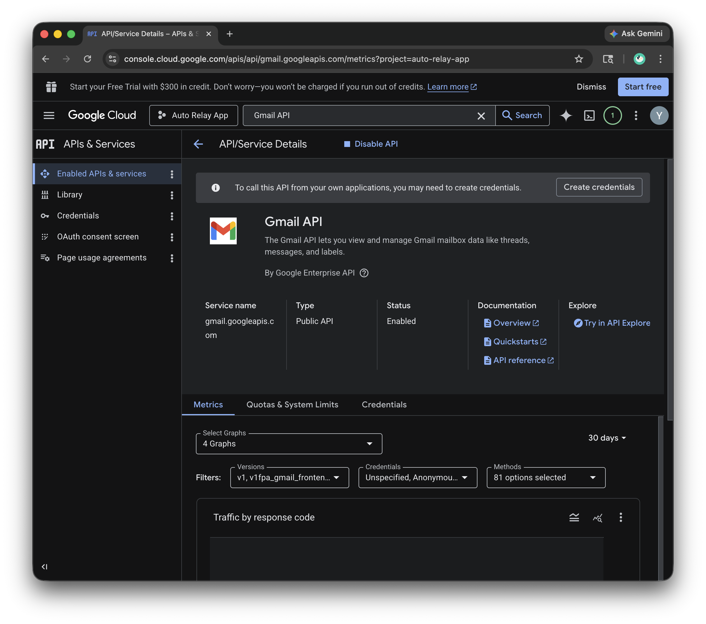
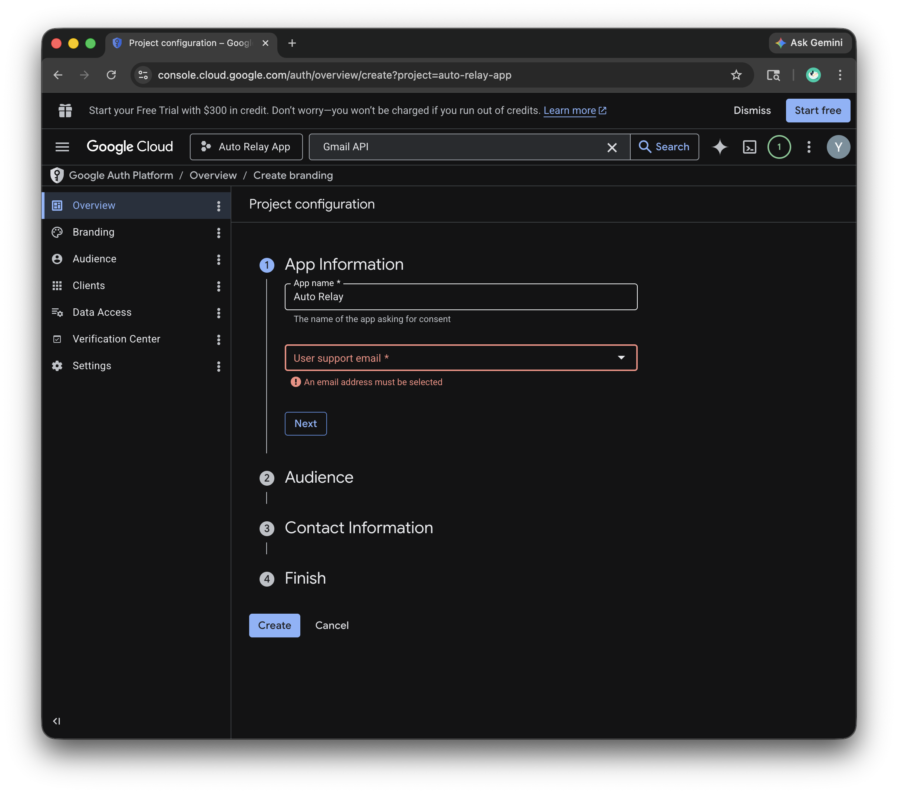
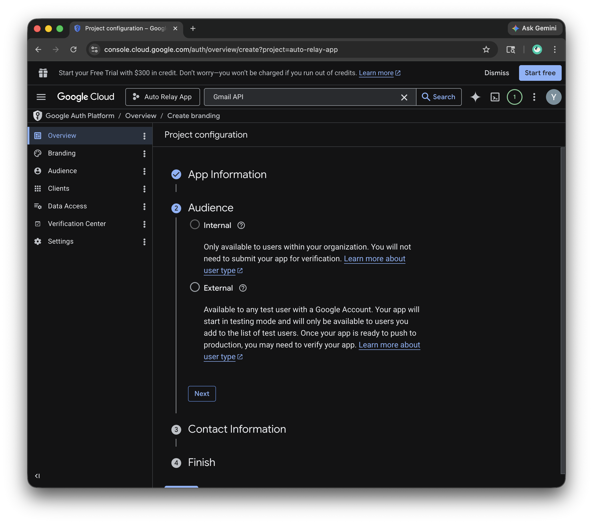
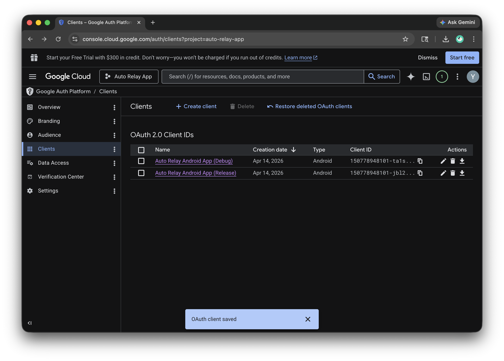

# Configuring Gmail Email Forwarding

Email forwarding allows the app to send your messages to your inbox.

If you're using the version from the Play Store, simply **Sign In** with
your Google account in the app and you're all set.

## For Developers (Self-Building)

If you are building the app from source code, you'll need to set up your
own Google Cloud project to enable the Gmail API:

### Step 1. Enable Gmail API

Go to the [Google Cloud Console](https://console.cloud.google.com/), create
a project, and enable the **Gmail API** under **APIs & Services**.

Screenshot: Enable Gmail API

### Step 2. Setup OAuth

Configure the **OAuth consent screen** (set to "External") and add your
email as a "Test User."

Screenshot: Enable Google Auth (Step 1)

Screenshot: Enable Google Auth (Step 2)

### Step 3. Register your App

Create an **Android OAuth client ID**.

Use `com.autorelay.app` as the package name, or your own package name if
you've changed it.

For the SHA-1 fingerprint, you can use either of these methods:

(1) **Recommended**: Run `./gradlew signingReport` in the Android Studio Terminal and copy the **SHA1** from the `debug` variant.
(2) **Manual**: Run `keytool -keystore ~/.android/debug.keystore -list -v -storepass android` and copy the SHA-1 code.

Screenshot: Google Auth Clients

That's it! No extra config files are needed — Google verifies your app
automatically using your package name and certificate.
