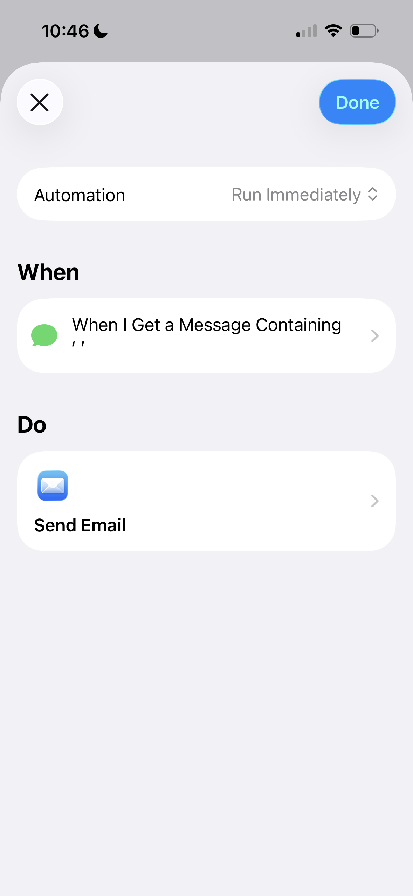
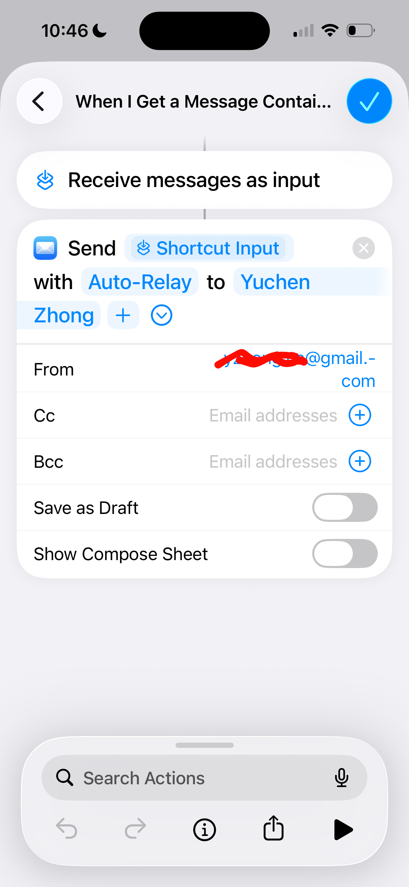

# Setting Up Message Forwarding on iPhone

On iOS you don't need a third-party app. The built-in **Shortcuts**
app has an Automation feature that can forward any incoming message
to your email automatically.

## Step 1. Create a new automation

Open the **Shortcuts** app, go to the **Automation** tab, and tap
**New Automation**. Choose **Message** as the trigger.

## Step 2. Configure the trigger filter

iOS requires at least one filter to activate the automation. To
catch every incoming message:

- Set **From** to **Any Contact** (or leave it unconstrained).
- Under **Message Contains**, type a single **space character**.

A single space matches virtually all real messages, so this
effectively forwards everything without needing to enumerate senders
or keywords.

## Step 3. Add the email action

Tap **Next**, then add the **Send Email** action. Configure it:

- **To**: your email address
- **Subject**: `Auto-Relay`
- **Body**: tap the field and insert the **Shortcut Input** variable
  so the original message text appears in the email body.

## Result

Every incoming message triggers the automation and sends an email
with the subject **Auto-Relay**, making it easy to search, filter,
or pipe into other workflows.

